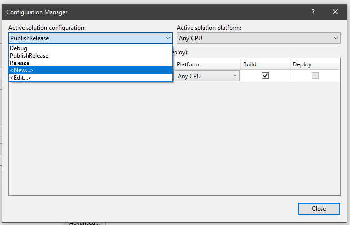
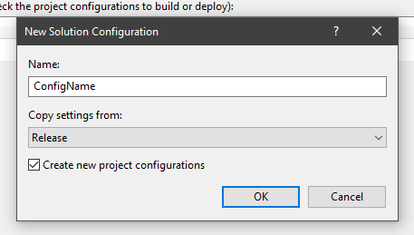

# VersionChanger
Small console application to change the version of a C# application

**Content**
<!-- TOC -->

- [VersionChanger](#versionchanger)
    - [What is the purpose?](#what-is-the-purpose)
    - [Configuration](#configuration)
        - [Command line parameters](#command-line-parameters)
        - [Configuration file](#configuration-file)
        - [Version type](#version-type)
        - [Version format](#version-format)
    - [Usage / Installation (Pre-Build Event)](#usage--installation-pre-build-event)
        - [Conditions](#conditions)
    - [.NET Core version](#net-core-version)

<!-- /TOC -->

## What is the purpose?
If you want to update the assembly version of a C# program you can do it manually by setting the values in the `AssemblyInfo.cs`. But when you have to do it manually the danger is great that you forget it. It's happened to me a lot. I've build my application and shipped it to the customers and then I noticed that I forgot to update the version number. So I had to go back to Visual Studio, update the version number and so on. Because of that I've created this small console application which will update the version number automatically. I've installed the *VersionChanger* as a pre-build event to my project and now I don't have to worry about the version number anymore.

## Configuration
The program offers you the possibility to specify some settings to customize the version number a little bit.

The following settings can currently be made
- The type of the version number (default: Days of the year, see [Version type](#version-type))
- The format of the version number (default: four places, see [Version format](#version-format))
- The version which should used
- The path of the assembly file

There are two ways how to set the settings:
1. Command line parameters
2. Configuration file

### Command line parameters
The tool can start with command line parameters. The following parameters are supported:

| Nr. | Switch    | Description     | Example |
|----:|-----------|-----------------|---------|
| 1.  | *-major*     | Major number    | `-major 1` |
| 2.  | *-minor*     | Minor number    | `-minor 2` |
| 3.  | *-build*     | Build number    | `-build 4`  |
| 4.  | *-revision*  | Revision number | `-revision 12` |
| 5.  | *-file*      | Assembly file path | `-file  "C:\Repos\Application\Properties\AssemblyInfo.cs` |
| 6.  | *-version*   | Version number | `-version 1.2.4.12` |
| 7.  | *-format*    | Version format (see: [Version format](#version-format)) | `-format 2` |
| 8. | *-type* | Version type (see: [Version type](#version-type)) | `-type 1` |

> **Note** All parameters are optional and case intensitive.

**Example**
1. Assembly file and complete version

    ```
    VersionChanger.exe -file "C:\Repos\Application\Properties\AssemblyInfo.cs" -version 1.2.4.12
    ```

2. Assembly file and major and minor number

    ```
    VersionChanger.exe -file "C:\Repos\Application\Properties\AssemblyInfo.cs" -major 1 -minor 2
    ```

3. Major, minor, build and revision number

    ```
    VersionChanger.exe -major 1 -minor 2 -build 4 -revision 12
    ```

### Configuration file
The settings can also be made in a configuration file. The file has the following format:

```json
{
    "Version": {
        "Major": 1,
        "Minor": 2,
        "Build": 3,
        "Revision": 4
    },
    "AssemblyInfoFile": "D:\\Repositories\\MyApplication\\Properties\\AssemblyInfo.cs",
    "Format": 2,
    "VersionType": 1
}
```

> **Note**: The name of the configuration file must be **VersionChangerConfig.json** and must be in the same folder as the application.

### Version type
If you don't set the version by yourself a new version number will be automatically generated. The format of the generated version is:

- Major: The last two numbers of the year (2019 > 19)
- Minor. Here are two possibilities:
    1. *Type 1*: Days of the year (e.G. 261) (this is the default type)
    2. *Type 2*: Calendar week (e.G. 38)
- Build
- Revision: Minutes since midnight (e.G. 1146 > ~7pm)

The *Build* number is calculated automatically. When the *major* and *minor* numbers are equal with the generated version the build number is increased by 1. When the numbers not equal the build number starts at 0.

**Example (numbers equal)**
- Current version: `19.261.0.1146`
- Generated version: `19.261.0.1147`

The *major* and the *minor* numbers are equal. New version: `19.261.1.1147`

**Example (numbers not equal)**
- Current version: `19.260.4.1146`
- Generated version: `19.261.0.1147`

The *major* and the *minor* numbers are not equal. New version: `19.261.0.1147`

### Version format
The following formats are supported:

| Id | Description | Example |
|---:|-------------|---------|
| 1  | Short format with only two places. | `1.2` |
| 2  | Middle format with three places. | `1.2.3` |
| 3  | Long format with four places (default) | `1.2.3.4` |

> **Note**: If you provide the version number with the switch `version` it will be parsed automatically by the `Version.Parse`-Method ([for more information click here](https://docs.microsoft.com/en-us/dotnet/api/system.version.parse?view=netframework-4.8)).

## Usage / Installation (Pre-Build Event)
If you want to install the *VersionChanger* as a pre-build event you have to do the following:
1. Copy the executable of the *VersionChanger* to your desired project (I've copied it into the folder where the solution file is located).
2. *Right click on the project > Properties*
3. Select the tab *Build Events*
4. Add the following: `$(ProjectDir)VersionChanger.exe`

As soon as you compile the project now, the version number will change.

**Build output**
```
1>------ Rebuild All started: Project: Clock, Configuration: Release Any CPU ------
1>  No version number was specified. Number is generated
1>  Version numbers:
1>  	- Current version: 19.37.3.1250
1>  	- New version....: 19.37.4.1252
1>  Version updated.
1>  Clock -> D:\Repo\Clock\bin\Release\Clock.exe
========== Rebuild All: 1 succeeded, 0 failed, 0 skipped ==========
```

### Conditions
If you don't want the the version number is changed with every build, you can add some conditions to the pre-build event. For example, the number should only be changed when you compile the project as release:

```batch
if $(ConfigurationName) == Release (
    $(ProjectDir)VersionChanger.exe
)
```

> **Note** The command will be interpreted line-by-line the same way as a DOS batch file, so it's important to place the opening **"("** in the same line as the **if** statement! <br /><br />
Special thanks to [Laszlo Pinter](http://pinter.org/archives/1348) for his article about pre-/post-build events


But sometimes you want to build your project as release without changing the version number. For this case I have created the configuration *PublishRelease* for me.

A new configuration can be created under *Build > Configuration Manager...*:

1. Create a new configuration

   

2. Enter the desired name and select *Release* at *Copy settings from*

   

3. Click OK

Now you can add your configuration name to the pre-build event.

**Example**
- Build with configuration *Release*:

    ```
    1>------ Rebuild All started: Project: Clock, Configuration: Release Any CPU ------
    1>  Clock -> D:\Repo\Clock\bin\Release\Clock.exe
    ========== Rebuild All: 1 succeeded, 0 failed, 0 skipped ==========
    ```

- Build with my custom configuration *PublishRelease*

    ````
    1>------ Rebuild All started: Project: Clock, Configuration: PublishRelease Any CPU ------
    1>  No version number was specified. Number is generated
    1>  Version numbers:
    1>  	- Current version: 19.37.4.1252
    1>  	- New version....: 19.37.5.1273
    1>  Version updated.
    1>  Clock -> D:\Repos\Clock\bin\PublishRelease\Clock.exe
    ========== Rebuild All: 1 succeeded, 0 failed, 0 skipped ==========
    ```

## .NET Core version
The .NET core version is still in development and differs from the .NET Framework application!
